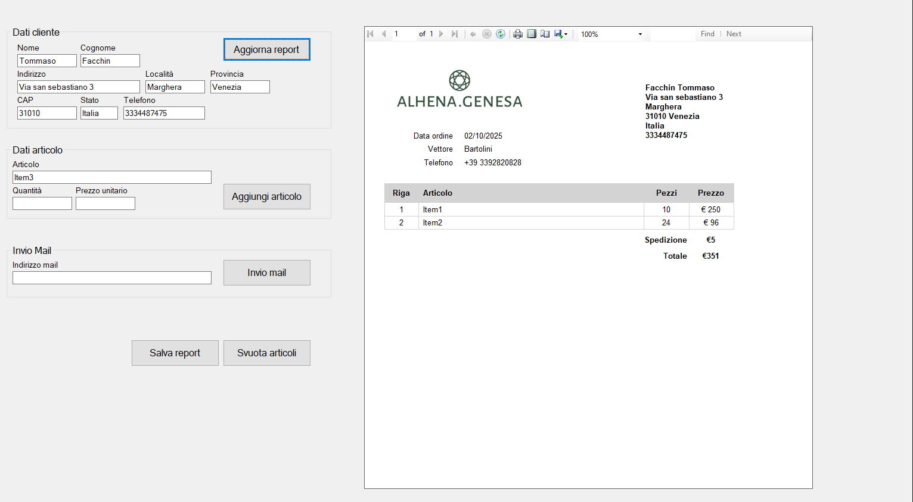

# Genesa Report Creator

**Genesa Report Creator** is a small C# .NET program I developed to help my mum manage her sales more efficiently. The application allows her to generate professional order confirmation reports in PDF format and automatically send them to clients via email. By combining a simple Windows Forms interface with automated email and PDF generation, it simplifies routine tasks and reduces errors in order management.

The program was built with usability in mind. It can store client and item data in JSON files, making it easy to reuse previous information and speed up the order process. The application also includes features like autocomplete for items, automatic total calculation, and real-time PDF preview using a report template (`R_ORDER_CONFIRMATION.rdlc`).

---

## How It Works

When the program starts, it loads the client and item data from `clients.json` and `items.json`. Users can then:

1. Enter client details (name, address, email, etc.) and order items.
2. Add multiple items with quantity and price, which are automatically summed to calculate the total.
3. Preview the order in a professional PDF format.
4. Save the PDF to a dedicated `reports/` folder.
5. Send the PDF directly to the client via email using a configured SMTP account.

If a client or item is not already in the JSON files, the program will automatically save the new data for future use. This ensures that repetitive information only needs to be entered once.

the pdf export is actually centered :)
---

## Project Structure

- **Form1.cs** → main application logic, including PDF generation, client/item management, and email sending.  
- **R_ORDER_CONFIRMATION.rdlc** → report template used for PDF generation.  
- **clients.json** → stores client information.  
- **items.json** → stores item information.  
- **reports/** → folder where generated PDFs are saved.

